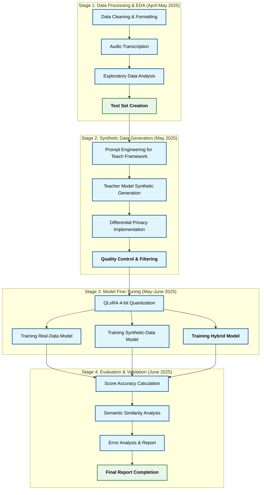

# Aligning AI-Generated Teacher Performance Evaluations with Human Judgments: A SwiftScore–World Bank Collaboration

## Introduction

Teacher performance evaluation is a critical pillar of educational quality assurance, directly impacting student learning outcomes. Effective teachers drive better student results, yet educators often lack scalable ways to gather reliable information on classroom practice. Traditional evaluation methods – such as in-person classroom observations – are labor-intensive, subjective, and difficult to scale across thousands of schools. SwiftScore, an AI company specializing in teacher performance evaluation, aims to address this gap by leveraging artificial intelligence to analyze classroom audio transcripts and produce evaluative feedback aligned with the World Bank's established Teach framework. This collaboration with the World Bank is motivated by a shared goal: developing a scalable **and** privacy-preserving teacher evaluation system that aligns closely with human expert judgments.

The value of a scalable AI-driven audio evaluation approach is clear – AI can process far more classroom transcripts than human evaluators, providing timely feedback and analytics to inform policy and teacher professional development. Our audio-only approach emphasizes accessibility for schools worldwide, recognizing that video recording infrastructure is often costly and impractical in many educational settings. Research suggests that integrating AI into teaching evaluations can make the process more **objective, reliable, and efficient**. AI algorithms can consistently apply the same criteria to all teachers, reducing the idiosyncratic biases that human observers might introduce. Moreover, AI can analyze the nuances of classroom discourse reflected in transcripts to provide a complete understanding of teaching effectiveness in line with the Teach framework's established dimensions and indicators.

**Privacy preservation** is an equally important motivator. Teacher evaluations involve sensitive data – classroom recordings, student interactions, and personal performance feedback – which must be handled with care. By focusing on audio transcripts rather than video data, we reduce privacy concerns while still capturing essential teaching quality indicators. Both SwiftScore and the World Bank prioritize compliance with privacy standards and ethical AI use in education. Techniques like *differential privacy* offer a way to harness data while protecting individual identities: they provide mathematically rigorous guarantees that an algorithm will not reveal details about any single person's data. By training AI models on a mixture of real and **synthetically generated** data (artificial data that mirrors the statistical properties of real examples without exposing private details), we can increase the size of the dataset beyond the example classroom transcripts. Recent advances show that **differentially private synthetic data** can retain the useful characteristics of the original dataset while preventing leakage of personal information. This means an AI model can learn general patterns of good teaching from real classroom transcripts, but the training process or outputs will not expose any specific teacher's identity or exact classroom scenario.

**The primary motivation** for the study is determining **AI alignment with human judgment** in education. Any AI-generated teacher evaluation must be closely aligned to what expert human evaluators (such as experienced school inspectors or instructional coaches) would conclude based on the Teach framework. In high-stakes educational decisions, stakeholders need confidence that the AI is fair, transparent, and essentially an extension of the established evaluation criteria. If the AI's scoring or feedback deviates significantly from human judgment, it could undermine trust or even unfairly impact teachers' careers. Therefore, this project is fundamentally about *alignment*: we seek to train and test AI models that process audio transcripts so that their evaluations of teaching quality are indistinguishable from those of skilled human observers (within an acceptable margin of error). By doing so, we ensure the technology augments human-led evaluation processes rather than conflicting with them.

## Literature Review and Background

### AI and Synthetic Data Generation for Training

Recent developments in artificial intelligence have demonstrated the power of synthetic data generation for training models, especially large language models (LLMs). Instead of relying solely on human-collected datasets, researchers have shown that AI systems can **generate their own training data** to fine-tune smaller models. This approach employs a "teacher-student" paradigm for knowledge transfer: a **teacher model** (often a large, state-of-the-art AI like GPT-4) is prompted with a task and produces high-quality synthetic outputs, and a **student model** (a smaller, more efficient model) is then supervised on those input-output pairs.

For instance, Wang et al. (2023) introduced the *Self-Instruct* method, which uses a strong pretrained LLM to produce instruction–response examples that can train another model. Taori et al. (2023) and others expanded on this approach by using an even larger teacher model and ensuring diversity in the generated data, enabling the student model to learn a wide range of behaviors. This line of work shows that *model-generated data can serve as an effective substitute or supplement for real data* in training, dramatically reducing the need for expensive human labeling.

The approach is particularly relevant for our project: we plan to use a high-capability teacher AI to generate synthetic classroom evaluation data based on audio transcripts, which will then help train SwiftScore's evaluation model. Prior research indicates this can be done without significant loss of fidelity – models trained on a blend of human and AI-generated data have achieved performance close to those trained purely on human data. Synthetic data generation also allows control over scenarios; we can create examples of rare but important classroom situations (e.g., handling a disruptive student) to ensure the model learns to evaluate them according to the Teach framework, even if such cases were infrequent in the real dataset.

### Differential Privacy for Sensitive Educational Data

Educational data, especially teacher and student information, is highly sensitive. **Differential privacy (DP)** is a formal technique to safeguard individual privacy when analyzing or learning from data. In simple terms, DP introduces calibrated randomness so that an AI model or dataset **cannot reveal whether any single individual's data was included**, providing strong privacy guarantees. This concept is crucial for the World Bank and SwiftScore, as we must protect teacher identities and student information in any shared data.

Recent research by Google and others has pioneered methods to generate *differentially private synthetic text data* using large models. Kurakin and Ponomareva (2024) describe new methods where an LLM is fine-tuned with DP or used in a special inference mode to produce synthetic data that mimics real data patterns without exposing private details. Such **DP synthetic data** retains the statistical properties and utility of the original data (so that an AI model trained on it learns useful lessons) but offers *strong privacy protection* because the data points are artificial.

This approach is particularly useful for organizations like the World Bank that want to share data with external partners (like SwiftScore) without risking confidential information. In fact, Google's internal teams have used differentially private synthetic data to collaborate across departments safely, and they note it as a way for organizations *with limited ML expertise to share sensitive data with external researchers* under privacy guarantees. Building on these ideas, our project will incorporate differential privacy during synthetic data generation to ensure no real teacher's data can be reverse-engineered from the AI's outputs. **Critically, this approach lays the foundation for continual improvement of the tool using datasets from our users without compromising their PII**, enabling an evolving system that gets better with use while maintaining rigorous privacy standards.

### AI in Education and Teacher Evaluation with the Teach Framework

The application of AI in education has grown rapidly, both in research and practice. AI is being used for intelligent tutoring systems, automated grading, student feedback, and more. When it comes to **teacher evaluation**, which traditionally involves classroom observations and appraisal by peers or supervisors, AI offers new opportunities and has become a burgeoning area of exploration.

The World Bank's **Teach framework** is a structured classroom observation tool designed to holistically measure what happens in the classroom. It focuses on practices that nurture children's cognitive and socioemotional skills, capturing both the quality of teaching practices and the extent to which teachers can keep students engaged. The framework consists of specific elements, each with defined behaviors and scoring rubrics that human evaluators use to assess teaching quality. Our AI model will be specifically trained to recognize and evaluate these same elements from classroom audio transcripts, ensuring alignment with this established and validated evaluation methodology.

Zhao et al. (2021) note that the introduction of AI technology into in-class teaching evaluation has become a *research hotspot*, due to the dominant role of classroom teaching in educational quality. There is growing evidence that AI-driven systems can complement or even enhance the evaluation process. Their system combined traditional evaluation metrics with new AI-derived indicators and used ensemble learning to produce an overall performance score. The experiments demonstrated that such an AI model could evaluate certain aspects (e.g., student participation, instructional style) with accuracy comparable to human assessors, and with greater consistency.

Another example comes from Almubarak et al. (2024) in Saudi Arabia, who explored an AI-based teacher performance evaluation system. Their findings reinforced that **AI-based teacher evaluation can overcome many limitations of current methods**, making evaluations more objective and timely. Traditional classroom observations often suffer from observer bias and inconsistency – one observer might be more lenient or stricter than another, which is a documented issue even in World Bank's own Teach observation tool. AI can help standardize this by applying the same rubric objectively across classrooms. Additionally, AI can provide *immediate feedback* – instead of waiting for a scheduled observation and feedback session, teachers could get automated feedback soon after a class, when reflections are most useful. This timely feedback loop is something education experts value for professional growth.

However, the literature also cautions about challenges. AI models must be carefully trained to avoid perpetuating biases present in historical data. If past evaluations (used as training data) were biased against certain types of teachers or schools, the AI could learn those biases. This underscores the importance of mixing diverse and possibly simulated data and applying fairness checks. There are also concerns about teacher autonomy and acceptance: educators may worry about an "algorithm" watching their every move, potentially creating a sense of surveillance. Policy guidance, such as a 2023 report by the U.S. Department of Education, emphasizes keeping **humans in the loop** and ensuring AI tools are *explainable and overrideable* by educators (i.e., teachers should be able to contest or understand an AI's evaluation). Our proposal keeps these insights in mind, aiming to build an AI evaluation system that is accurate and helpful, yet ultimately under human supervision and used for supportive rather than punitive purposes.

In summary, the background research suggests that: (a) synthetic data generation and large teacher models can successfully produce training data for alignment, (b) differential privacy can be employed to protect sensitive education data when training AI models, and (c) AI has shown promise in evaluating teaching performance, provided it is aligned with established criteria like the Teach framework and used ethically. This project will synthesize these strands by using **synthetic, privacy-preserving data based on audio transcripts to train an AI model for teacher evaluation that mirrors human expert judgments** according to the Teach framework.

## Project Goals and Timeline (Complete by June 2025)

This collaborative project between SwiftScore and the World Bank is structured around clear goals to be achieved by June 2025. The primary objectives and deliverables include:

- **Evaluate AI–Human Score Similarity Using Audio Transcripts:** Measure how closely the AI-generated teacher evaluations based on classroom audio transcripts match human evaluator outputs using the Teach framework. We will quantify the alignment between model-produced scores/feedback and the scores given by expert observers on the same teaching sessions. A successful outcome would be an AI model whose evaluations correlate strongly with human judgments (e.g., high Pearson correlation for numeric scores and high agreement on qualitative feedback content), indicating that the model can serve as a reliable proxy for human evaluators using only audio data.
- **Demonstrate Reliability of Synthetic Data for Fine-Tuning:** Show that models trained on a mixture of real and **synthetically generated transcript data** can perform as well as (or even better than) models trained on real data alone. In other words, we aim to validate that synthetic data augmentation does not degrade evaluation accuracy. If successful, this will illustrate a path for using **privacy-safe synthetic data** to improve AI models in education. A key milestone will be a comparative analysis: for example, training one model on real data only, and another on real + synthetic, and demonstrating that the latter has equal or superior alignment with human evaluations.
- **Maintain Privacy and Data Security:** Throughout the project, ensure that no sensitive or personal data is compromised. By design, using differential privacy and synthetic data will mean that raw data (such as original classroom recordings) never leave the secure environment. A goal is to document and confirm that the privacy techniques effectively prevent any leakage of teacher or student identities. We will produce a brief privacy assessment report by the end of the project, which can be shared with policy stakeholders to build confidence in the approach.
- **Open-Source Fine-Tuning Code and Methodology:** To contribute to the broader community and promote transparency, SwiftScore will open-source the non-proprietary components of this project. This includes the code for data preprocessing, synthetic data generation scripts, and the fine-tuning pipeline (e.g., QLoRA training scripts and evaluation routines). The intention is to publish these so that other researchers or education agencies can replicate or adapt the approach for their own datasets. **Important:** While the fine-tuning code and methodology will be public, the resulting trained model (and any SwiftScore proprietary model weights) will remain the intellectual property of SwiftScore. In essence, we share the "recipe" but not the final "product" weights, ensuring SwiftScore's commercial product is protected while still contributing knowledge to the community.

By meeting these goals, the project will answer the core question: **Can an AI model trained on a mix of real and synthetic audio transcript data produce outputs that are practically indistinguishable from human evaluations using the Teach framework?** Achieving this would be a significant step toward scalable, AI-assisted teacher evaluation processes that maintain human-aligned standards and respect privacy, while being accessible to schools with limited infrastructure resources.

## Methodology

### Stage 1: Data Cleaning and Exploratory Data Analysis (EDA)

In Stage 1, we focus on preparing the dataset provided by the World Bank and understanding its characteristics:

- **Data Cleaning and Formatting:** We will convert all provided data into a structured, analyzable format (e.g., CSV or parquet tables). This involves standardizing field names, handling missing or corrupted entries, and ensuring consistent encoding of categorical variables according to the Teach framework dimensions. If the World Bank's data comes from different sources, we will harmonize them into a common schema. Personal identifiers will be removed or anonymized at this step.
- **Transcription of Classroom Audio:** As agreed with the World Bank team, we will utilize state-of-the-art **speech-to-text** models to transcribe audio files into text. Advances in AI have made automatic transcription highly accurate even in challenging acoustic settings. This gives us a textual representation of the classroom interaction, which will be a key input for the evaluation model aligned with the Teach framework. After transcription, we will perform a manual spot-check on a subset of transcripts for quality assurance, paying particular attention to elements that are critical for assessment under the Teach framework.
- **Exploratory Data Analysis (EDA):** Once the data is cleaned, we will conduct thorough EDA focused on the transcript data. We will examine the distribution of human-given scores across the Teach framework dimensions, correlations between different evaluation criteria, and analyze the text transcripts for patterns relevant to teaching quality assessment. The EDA will also check for any biases or anomalies that might suggest the need for balancing the training data or augmenting certain under-represented scenarios with synthetic examples in the next stage.
- **EDA Outcome and Planning:** By the end of Stage 1, we will produce an internal EDA report that summarizes key findings. Additionally, Stage 1 sets the baseline: we preserve a portion of this cleaned transcript data as a **hold-out test set** which will later be used to evaluate model performance against human scores using the Teach framework.

### Stage 2: Synthetic Data Generation for Audio Transcripts

Stage 2 is the heart of our approach – here we generate a large corpus of synthetic teacher evaluation examples based on classroom audio transcripts to supplement the real data:

- **Teacher Model (Gemini 2.0 Flash):** We will use *Gemini 2.0 Flash*, a high-capability LLM, as our "teacher" model. We will prompt this model to act as a **virtual expert evaluator** using the Teach framework. For example, a prompt might feed the model a classroom transcript and then ask: *"Given the above lesson transcript, provide an evaluation of the teacher's performance on the Teach framework dimensions (Time on Learning, Quality of Teaching Practices, etc.) with scores and constructive feedback."* We will craft the prompts carefully to imbue the model with the World Bank's Teach evaluation criteria and rubric language.
- **Student Model (Gemma 3 27B):** As the "student" model that we ultimately want to fine-tune and deploy, we have *Gemma 3 27B*. Initially, Gemma 3 is an open-weight model that may have been pre-trained on general text but not specifically on teacher evaluation tasks using the Teach framework. It will learn from the synthetic transcript dataset that the teacher model generates.
- **Generation of Input-Output Pairs:** We will generate **context-aware transcripts and evaluations** in large quantity. Based on the EDA in Stage 1, we will prepare a variety of classroom transcript scenarios to feed into Gemini. For each synthetic data point, we have: **Input:** a class transcript or description, and **Output:** an evaluation (which could be a set of scores on Teach framework categories plus narrative feedback text).
- **Quality Control of Synthetic Data:** We will implement checks to ensure the synthetic evaluations are realistic and aligned with expected human outputs using the Teach framework. This might involve filtering out any generations from Gemini that are obviously flawed. We can use heuristic filters or even another AI model to rank the quality of outputs. We will manually review a sample to ensure the synthetic evaluations reflect the tone a real evaluator would use – constructive, objective, and following the Teach rubric.
- **Differential Privacy Measures:** To preserve privacy, we integrate **differential privacy techniques** into the generation process. One straightforward step is to ensure that no actual teacher or school names from the real data appear in the synthetic outputs. More formally, we are exploring using Google's approach of *differentially private prediction* during generation. This would involve adding a calibrated noise mechanism to the teacher model's output selection, ensuring that the presence or absence of any single real data point in the prompt has limited influence on the final generated text. By the end of Stage 2, we expect to have a **large synthetic dataset** on the order of thousands of (transcript, evaluation) pairs, diverse across teaching styles, subjects, and contexts, all generated in a privacy-conscious manner.
- **Mixing Real and Synthetic Transcript Data:** Although synthetic data will form the bulk of our training set, we will also prepare a **mixed dataset** that combines a sample of real transcript data with the synthetic data. This helps "ground" the model in reality and provides some direct human-supervised examples. Some research suggests that a mix of real and synthetic data can stabilize training and keep the model from drifting too far from human style.

By the end of Stage 2, we will have curated training datasets (synthetic-only and synthetic+real) based on classroom audio transcripts that are ready for model fine-tuning. All steps and code used to generate this data will be documented, and non-sensitive portions will be prepared for open-source release as per our goals.

### Stage 3: Supervised Fine-Tuning of the Audio-Based Evaluation Model

Stage 3 involves using the transcript data from Stage 2 to train the SwiftScore model that will produce teacher evaluations:

- **QLoRA Fine-Tuning:** We plan to utilize **Quantized Low-Rank Adaptation (QLoRA)** for model fine-tuning. QLoRA is an approach that dramatically reduces the memory footprint of training large language models by quantizing them to 4-bit precision and then learning small adaptation matrices (LoRA layers) on top of them. This method allows, for example, a 65B parameter model to be fine-tuned on a single GPU with 48GB memory, without significant loss in performance compared to full 16-bit training. In our context, using QLoRA means we can fine-tune the 27B model efficiently, which is important for practicality.
- **Training Procedure:** We will fine-tune the model on the mixed transcript dataset using supervised learning. Each training sample will consist of an input (the transcript or class scenario text) and a target output (the evaluation text or scores according to the Teach framework). The training objective will be to minimize the difference between the model's generated output and the target output. Because some of our outputs might be structured (e.g., numeric scores followed by textual commentary), we will format the target in a consistent textual format during training.
- **Quantization to 4-bit:** As mentioned, the model will be in 4-bit mode during training, and we will maintain it in a 4-bit quantized state for inference as well. Operating the model in a 4-bit precision mode drastically improves speed and lowers memory usage, with only a minor impact on output quality. This is crucial for making the eventual product affordable for deployment, especially in resource-constrained educational settings where our audio-only approach is targeted.
- **Experimentation with Variants:** To fully answer our research questions, we will train a few variants of the model:
    - *Model A:* Fine-tuned on real audio transcript data only
    - *Model B:* Fine-tuned on synthetic audio transcript data only
    - *Model C:* Fine-tuned on the mixture of real + synthetic audio transcript data (our primary model)
    
    Comparing these will help demonstrate the value of synthetic data. We hypothesize Model C will perform best (since the synthetic data adds more coverage), and Model B will be close behind, whereas Model A might suffer if the real data was limited or sparse in certain scenarios.
    

By the end of Stage 3, we will have a fine-tuned model that is ready to be evaluated. All fine-tuning code (training loops, hyperparameters, etc.) will be saved and later cleaned up for the open-source release, allowing others to reproduce our training process.

### Stage 4: Model Evaluation and Validation Against the Teach Framework

Stage 4 is dedicated to rigorously evaluating the performance of the fine-tuned AI model against human evaluations using the Teach framework as well as against benchmark AI models:

- **Inter-rater Reliability Measures:** A primary focus of our evaluation will be to assess the AI's performance using established inter-rater reliability metrics:
    - **Cohen's Kappa:** We will calculate Cohen's kappa to measure agreement between AI and human evaluators across the Teach framework dimensions. This statistic accounts for agreement occurring by chance and is widely used in educational assessment validation. Our target will be to achieve kappa values consistent with acceptable standards in the education literature for human-to-human agreement on classroom observations.
    - **Intraclass Correlation Coefficient (ICC):** For continuous scoring elements, we will compute ICC to measure consistency between human and AI ratings. This will help determine if the AI can reliably rank teachers in the same order as human observers would, even if the absolute scores differ slightly.
    - **Percentage of Exact Agreement:** We will calculate the percentage of cases where AI and human scores match exactly, as well as the percentage falling within one point on the Teach framework scale.
- **Benchmarking Against Human-to-Human Reliability:** A key approach in validating our AI system will be to compare its agreement with human evaluators to the typical agreement between multiple human evaluators using the Teach framework. Research in educational assessment consistently shows that even well-trained human raters exhibit variability. We will use established minimum thresholds for acceptable inter-rater reliability in education research to determine whether the AI performs at a level comparable to what would be expected from a well-trained human evaluator. The World Bank's previous analysis of rater variability in their Teach observation tool provides valuable context for interpreting our results.
- **Additional Evaluation Metrics:** Beyond reliability measures, we will evaluate:
    - **Score Accuracy and Agreement:** We will compare numerical scores using metrics such as **mean absolute error (MAE)** or **Pearson correlation coefficient** across the Teach framework dimensions.
    - **Semantic Similarity of Feedback:** For the narrative feedback, we will use **embedding-based similarity** measures – for instance, cosine similarity between the AI feedback and human feedback in a sentence embedding space. We may also calculate overlap-based metrics like **BLEU and ROUGE**.
    - **G-index and Gwet's AC:** We will implement additional agreement statistics that are robust to prevalence and bias problems that can affect kappa in certain scenarios.
- **Qualitative Error Analysis:** Beyond numeric metrics, our team will perform detailed error analysis. We will identify patterns in cases where AI-human disagreement is highest, categorizing the types of classroom interactions or teaching behaviors where alignment is weakest. This qualitative analysis is crucial for policy stakeholders to understand not just *how often* the AI aligns with humans, but *in what ways* it might still differ when applying the Teach framework.
- **Comparison with Control Models:** We will evaluate our fine-tuned models against two important controls:
    - **Base Gemma 3 27B:** To quantify the improvement gained through fine-tuning.
    - **ChatGPT (GPT-4o):** To benchmark against consumer-grade AI when evaluating teaching based on audio transcripts.
- **[OPTIONAL] Human Preference Testing:** We could conduct a *human preference study* where expert educators review AI-generated evaluations without knowing their source. A **Turing-test-style** comparison could ask experts to distinguish between AI and human evaluations for the same lesson, with inability to distinguish indicating successful alignment.
- **Visualization and Decision Thresholds:** To communicate findings clearly, we will create visualizations that explicitly show:
    - Agreement rates and kappa values across different Teach framework dimensions
    - Plots comparing reliability metrics for AI-human agreement versus human-human agreement from previous studies
    - Error analysis heatmaps showing where disagreements most commonly occur
    - Decision boundary analysis showing at what threshold values the AI system could be considered to perform at the level of a human rater according to education literature standards

By the conclusion of Stage 4, we will have a comprehensive picture of whether the AI model performs at levels of reliability comparable to human evaluators using the Teach framework. Rather than simply stating that the model "works well," we will be able to make evidence-based claims about whether its performance meets the same standards expected of human evaluators in educational settings. This analysis will provide a clear answer to our central question: Can an AI model trained on a mix of real and synthetic audio transcript data produce outputs that are practically indistinguishable from human evaluations using the Teach framework, according to accepted standards of inter-rater reliability in education?

## Impact and Dissemination

**Scalable and Equitable Teacher Support Through Audio-Only Evaluation:** By demonstrating an AI system that can replicate human-like teacher evaluations based solely on audio transcripts, we provide a blueprint for scaling teacher support in education systems worldwide. Many countries struggle with providing regular, high-quality feedback to all teachers due to limited expert evaluators. An AI tool like SwiftScore's, aligned with the World Bank's Teach framework and requiring only audio recordings, could be deployed to assist in continuous professional development: for example, teachers could receive automated feedback after submitting a class recording, along with targeted suggestions for improvement. This can complement (not replace) periodic human-led evaluations, ensuring that between official observations, teachers still get guidance. The outcome is a more **equitable system** where even teachers in remote or under-resourced areas get access to evaluative insights and coaching tips akin to what a pedagogical expert might provide.

**Ethical AI and Privacy in Education:** A significant impact of our work is the validation of methods (synthetic data and differential privacy) that enable AI innovation **without compromising privacy**. In an era of growing concern about data security, showing that we can train powerful evaluation models *without using identifiable personal data* is a policy win. It suggests a model for future AI projects in education: sensitive data can be transformed via privacy-preserving techniques and used to develop AI solutions safely. We will document how we applied DP and synthetic data generation in this project, providing a case study for privacy-by-design in AI development. Moreover, by open-sourcing the methodology, we empower others to adopt and build on these privacy-conscious approaches, fostering an ecosystem of trustable AI tools in education.

**Alignment with Human and Cultural Contexts Using the Teach Framework:** Our focus on alignment ensures the AI's impact is positive and **respectful of teachers' professional norms**. A concern often raised is that AI evaluations might be misused for high-stakes decisions or could diminish the professional agency of teachers. We address this by framing the AI as an assistive tool and by aligning it to the Teach framework, the same standards humans use. In fact, with AI handling routine analysis, human evaluators can spend more time on mentoring and less on paperwork. We also plan to include teachers and school leaders in reviewing the AI's outputs to ensure the feedback style is constructive and not perceived as unfair. The World Bank's involvement ensures a global perspective – we can tailor the model or its usage guidelines to different education contexts (what "good teaching" entails can have universal elements as captured by Teach, but also local nuances). The end result should be an AI evaluation system that is *globally informed but locally adaptable*.

**Comparative Performance Analysis:** By benchmarking our fine-tuned models against both the base Gemma 3 27B model and ChatGPT (GPT-4o), we will demonstrate the value of domain-specific fine-tuning for specialized educational tasks. This analysis will provide valuable insights into when general-purpose AI is sufficient and when specialized models offer meaningful advantages for high-stakes educational applications. Understanding these tradeoffs will be particularly valuable for World Bank contexts, where resource constraints may influence the choice of AI technologies for educational applications.

**Open-Source Release:** We will release the fine-tuning code, example prompts for synthetic data generation, and perhaps a sample of the synthetic dataset (ensuring it contains no real data). We will host this on a public repository under an appropriate license. The repository will contain documentation explaining how to reproduce our model training. This not only aids transparency but also allows other researchers to reuse components of our approach. We believe this contributes to the broader movement of open science in AI.

In communicating all results, we will highlight how **synthetic data and privacy-preserving AI based on audio transcripts** can responsibly scale teacher evaluation globally. This means sharing the message that even countries with strict data laws or limited ability to collect large datasets can still benefit from AI by using techniques like we employed. We foresee, for example, that a Ministry of Education could use our approach to generate a synthetic "national dataset" of teaching scenarios and use it to train their own version of a SwiftScore model, all while using perhaps only a small sample of actual observations under DP. This democratizes the ability to create AI models across regions.

Education is fundamentally a human endeavor, and any AI in this space must respect and enhance human decision-making, not replace it. Our research aims to show a path for AI to *amplify* expert capacity – by handling scale and routine analysis of audio transcripts – while *humans* remain in control of interpretation and final judgment. By publishing our methods and results, we hope to contribute to a growing body of evidence that AI, when developed conscientiously, can be a powerful ally in improving educational outcomes worldwide.

## References

1. Almubarak, A., Albidewi, I., Alhalabi, W., & Alharbi, E. (2024). *AI-based teacher performance evaluation in Saudi schools*.
2. Luna-Bazaldua, D., Pushparatnam, A., & Molina, E. (2021). *Making classroom observation tools better: a new study on Teach*. World Bank Blog.
3. Bie, A., & Syed, U. (2025). *Generating synthetic data with differentially private LLM inference*. Google Research Blog.
4. Kurakin, A., & Ponomareva, N. (2024). *Protecting users with differentially private synthetic training data*. Google Research Blog.
5. U.S. Department of Education Office of Ed Tech. (2023). *Artificial Intelligence and the Future of Teaching and Learning: Insights and Recommendations*.
6. Wang, Y., et al. (2023). *Self-Instruct: Aligning Language Models with Self-Generated Instructions*. ACL.
    
    ```mermaid
    flowchart TD
     classDef inputData fill:#e3f2fd,stroke:#1565c0,stroke-width:2px, color:#000000;
     classDef process fill:#f3e5f5,stroke:#6a1b9a,stroke-width:2px, color:#000000;
     classDef model fill:#fff8e1,stroke:#ff8f00,stroke-width:2px, color:#000000;
     classDef output fill:#e8f5e9,stroke:#2e7d32,stroke-width:2px, color:#000000;
    
     A["World Bank Classroom Videos"]:::inputData
     B["Audio Extraction & Transcription"]:::process
     C["Classroom Transcripts"]:::inputData
     D["Human Expert Evaluations"]:::inputData
    
     E["Train-Test Split"]:::process
    
     F1["Training Set (75%)"]:::inputData
     F2["Test Set (25%)"]:::inputData
    
     G["Synthetic Data Generation"]:::process
     H["Synthetic Transcripts & Evaluations"]:::inputData
    
     I["Fine-Tune Gemma 3 27B Model"]:::process
    
     J1["Real Data Model"]:::model
     J2["Synthetic Data Model"]:::model
     J3["Hybrid Model"]:::model
    
     K["Evaluation Against Human Scores"]:::process
    
     L["Reliability Metrics"]:::output
    
     A --> B
     B --> C
     C --> E
     D --> E
    
     E --> F1
     E --> F2
    
     F1 --> G
     G --> H
    
     F1 --> I
     H --> I
    
     I --> J1
     I --> J2
     I --> J3
    
     J1 --> K
     J2 --> K
     J3 --> K
    
     F2 --> K
    
     K --> L
    
     style A font-weight:bold
     style C font-weight:bold
     style D font-weight:bold
     style H font-weight:bold
     style J3 font-weight:bold
     style L font-weight:bold
    
    ```
    
7. Zhao, Z., Wan, B., et al. (2021). *An AI-application-oriented in-class teaching evaluation model by statistical modeling and ensemble learning*.
8. Dettmers, T., et al. (2023). *QLoRA: Efficient Finetuning of Quantized LLMs*.
9. Molina, E., Pushparatnam, A., Rimm-Kaufman, S., & Wong, K. (2020). *Evidence of teaching quality through classroom observation: Reliability and validity.* Teaching and Teacher Education.



